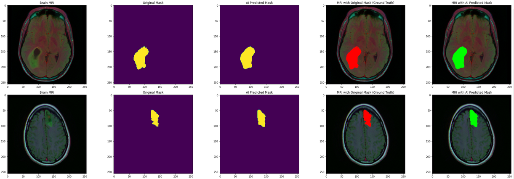

# ResUnet - Segmentation
In this notebook I am exploring segmentation and classification techniques on MRI dataset. This dataset contains images with healthy and cancerous brains with respective labeling and corresponding mask images. 

Above on the first image the MRI image of cancerous brain is plotted, on the second image the mask of the corresponding image is shown which is later superposed on the first image to highlight the cancer part. 

For classification, to detect which image is of either healthy or cancerous brain, ResNet is deployed. As for segmentation part a very famous architechture ResUnet is used. It is based on Unet architecture which is famous for its high performance in segmentation. The results are evaluated and an example is given below

